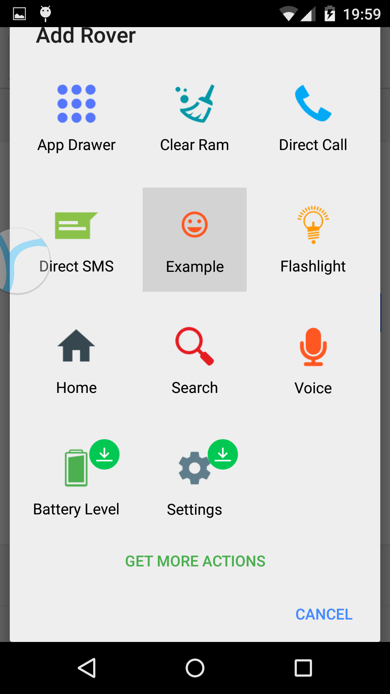

RoversActionApi
===============
an API for creating Rovers Actions for the Rovers app:
http://play.google.com/store/apps/details?id=com.schiztech.rovers.app

This is a simple api that will help you create Rovers Actions and add them to your existing applications, or make stand-alone Rovers Actions within minutes!

Screenshots
------------


<br/>


How-To Use
--------
#####Gradle:
```groovy
dependencies {
    compile 'com.schiztech:roversapilibrary:1.0.0'
    //make sure you have jcentral() listed as a repository
}
```

#####Creator Activity:
```android
  Intent roversActionIntent = RoversActionBuilder.build()
          .setColor() 
          .setIsColorChangeable()
          .setIconResource()
          .setIcon() //icon could be either resource or bitmap.
          .setIsIconChangeable()
          .setLabel()
          .setIntent()//the intent to be launched
          .create();

  setResult(RESULT_OK, roversActionIntent);
```
#####Manifest:
```xml
  <-- Icon & label fields will be used on the 'Add Rover' screen -->
  <activity
      android:name=".CreateActionActivity"
      android:icon="@drawable/ic_action_roveraction"
      android:label="@string/rovers_action_name"
      android:theme="@android:style/Theme.NoDisplay" >
    <!-- Rovers will identify this activity as a Rovers Action creator by the intent-filter -->
    <intent-filter>
        <action android:name="com.schiztech.rovers.action" />
    </intent-filter>
  </activity>

```

#####Additional meta-data (goes inside the Activity tag):
```xml
  <meta-data android:name="description" android:value="description of the rovers action" />
  <meta-data android:name="settings_activity" android:value="optional. settings activity of this rover
                                                  NOTICE: Settings Activity needs android:exported="true"" />
  <meta-data android:name="min_sdk" android:value="optional. integer value" />
  <meta-data android:name="max_sdk" android:value="optional. integer value" />
```

License
--------
```
Copyright (C) 2015 Schiztech Studio

Licensed under the Apache License, Version 2.0 (the "License");
you may not use this file except in compliance with the License.
You may obtain a copy of the License at

http://www.apache.org/licenses/LICENSE-2.0

Unless required by applicable law or agreed to in writing, software
distributed under the License is distributed on an "AS IS" BASIS,
WITHOUT WARRANTIES OR CONDITIONS OF ANY KIND, either express or implied.
See the License for the specific language governing permissions and
limitations under the License.
```

